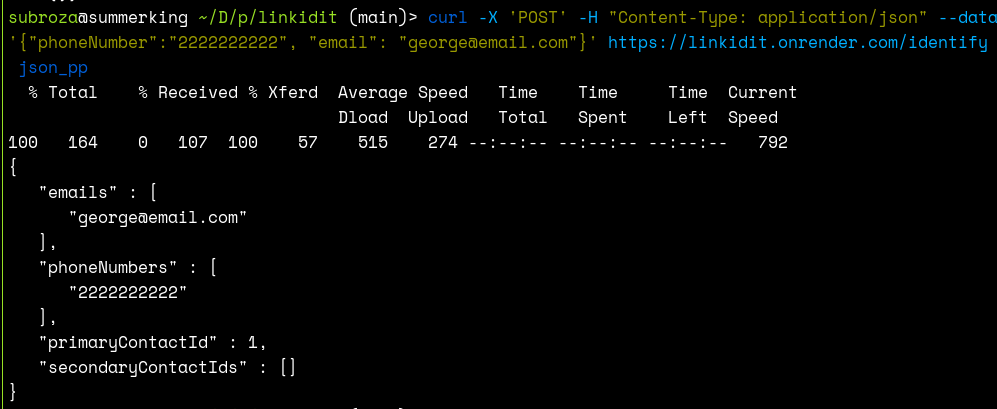

LinkIdIt

--- 

express+ts+sqlite app <br>
hosted@  [link](https://linkidit.onrender.com/identify)

## INTRODUCTION

Submission to [link](https://bitespeed.notion.site/Bitespeed-Backend-Task-Identity-Reconciliation-1fb21bb2a930802eb896d4409460375c)

**Endpoint**: `/identify`  <br>
**Expects**: 10 digit phoneNumber or valid email or both <br>
**Response**: Json with the required fields <br>
**Example**



**Logic**
1. Search for orders based on phoneNumber and email provided
2. Extract the earliest entry(lowest id), this is the parentOrderId
3. All other entries become secondary
4. Determine if a new record creation is required (if either phoneNumber or email not found in existing rows)
5. If multiple primary orders exist merge also change linkedId for children of records being merged
6. Create final response 


## RUN

run the development server using the following commands

```
$ npm install
$ npm run dev
```


